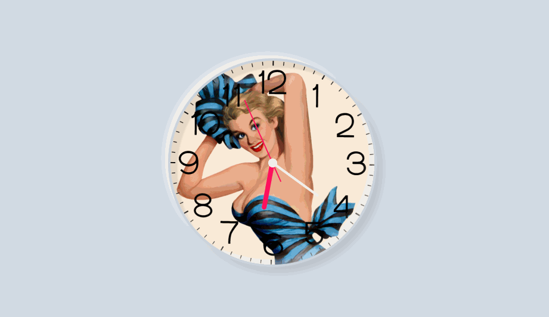

# Pin Up Analog Clock

Simple analog clock, designed with a pin up model, created with HTML, CSS and JS.

The live demo for this application can be found here: [https://fromzerotocicero-analog-clock.netlify.app/](https://fromzerotocicero-analog-clock.netlify.app/)

## Description

A simple HTML, CSS and JS analog clock, that displays the current time. It has an interesting neumorphism design, playing with the shadows and combining a clock face template with a pin up model background. Its primary use is for aesthetics, but can be easily adapted to be used in software projects.

## License

This project is licensed under the MIT License - see the LICENSE.md file for details.

## Acknowledgments

Inspiration and code snippets have been used from:
* [Online Tutorials](https://www.youtube.com/watch?v=weZFfrjF-k4&t=26s&ab_channel=OnlineTutorials)